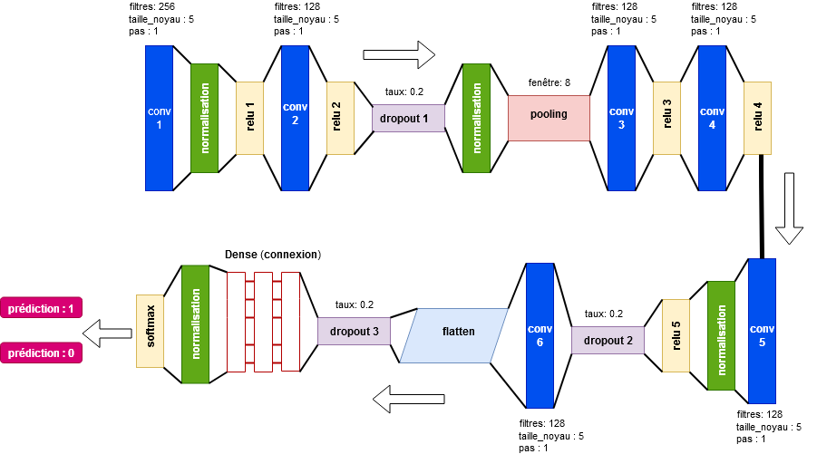

Description 
----------

The aim is to use two approaches for the binary classification of each emotion, first for Ravdess data, then for merged data


* A machine learning approach using several Standard classification models:
  Support Vector Machine (SVM), eXtreme Gradient Boosting (XGBoost), Random Forest (RF), Decision Tree (CART), K Nearest Neighbors (KNN), Logistic Regression (LR), Gaussian Naives Bayes (NB), Stochastic Gradient Descent (SGD)
  
  
* A deep learning approach using a convolutional neural network:





```python

```
